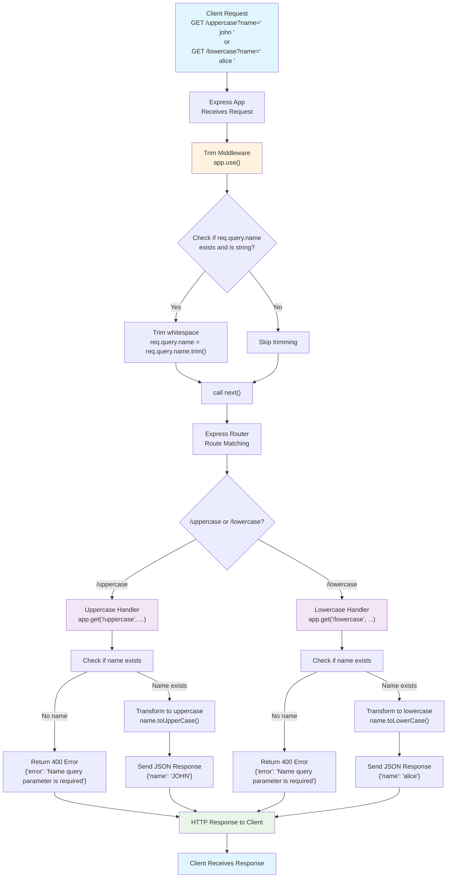

# Express Middleware Example

A simple Express.js server that demonstrates middleware usage with name transformation endpoints.

## What it does

This server has two endpoints that transform a `name` query parameter:
- `/uppercase` - converts the name to UPPERCASE
- `/lowercase` - converts the name to lowercase

All requests automatically have their `name` parameter trimmed of whitespace through middleware.

## Quick Start

```bash
npm install
npm run run
```

The server will start on `http://localhost:4135`

## Try it out

- `http://localhost:4135/uppercase?name=john` → `{"name": "JOHN"}`
- `http://localhost:4135/lowercase?name=ALICE` → `{"name": "alice"}`
- `http://localhost:4135/uppercase?name=  spaced  ` → `{"name": "SPACED"}` (whitespace trimmed)

## Request Lifecycle

Here's how requests flow through the application:



## Key Features

- **Middleware**: Automatically trims whitespace from name parameters
- **Error handling**: Returns helpful error messages for missing parameters
- **Simple API**: Just two endpoints with clear functionality
- **Port 4135**: Configured to run on a specific port for consistency 